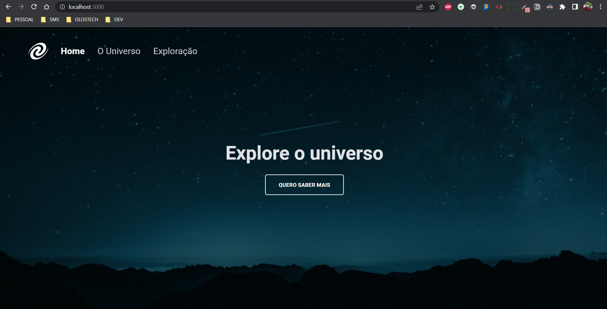
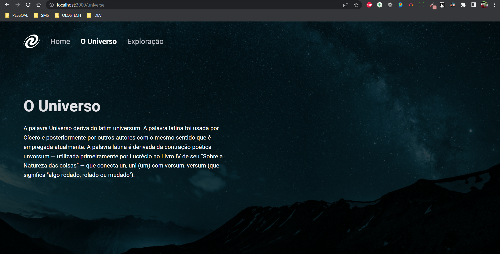
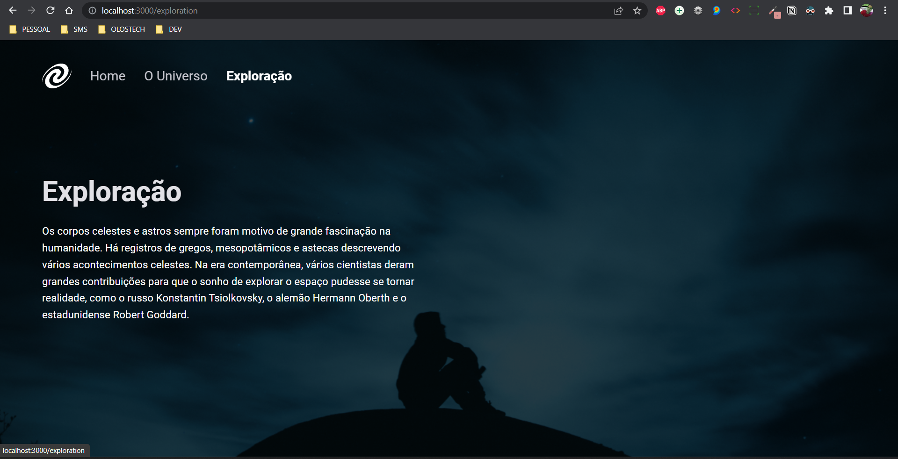
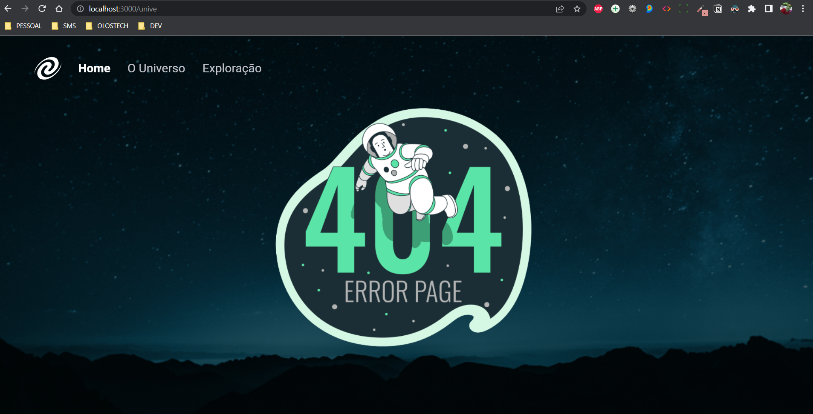

<h1 align="center">SPA Universe 🤓</h1>

Projeto SPA (Single Page Application) construído utilizando os conhecimentos adquiridos na Rocketseat sobre:

<ul>
  <li>SPA (Single Page Application</li>
  <li>Assincronismo</li>
  <li>Class e Orientanção a objetos.</li>
  <li>Mapeamento de rotas</li>
</ul>

<h2 align="center">Tecnologias utilizadas</h2>

Foi utilizado o HTML5, CSS3 e JavaScript, para o desenvolvimento da aplicação e todas as suas funcionalidades e também foi utilizado o NodeJS para criar um servidor para testes da aplicação.

  

Na página é possível navegar entre as outras páginas sem que seja necessário recarregar toda aplicação, ou ser redirecionado para um outro arquivo html:

E caso seja acessado um caminho que não existe na aplicação será apresentado um erro:

